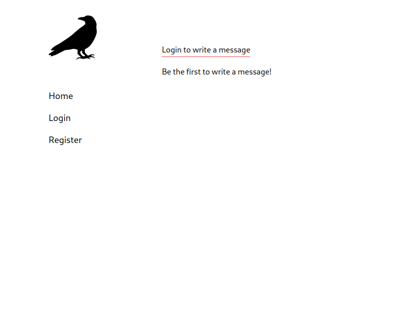

# Project: Members Only(client-side)

- Live link: <https://projectmembersonlyclient-production-b74e.up.railway.app/>
- Back-end link: <https://github.com/justEstif/project_members_only_server>

## Purpose

- A projects where users can write anonymous posts. It uses the roles to limit what a user can do.
- Project page: <https://www.theodinproject.com/lessons/nodejs-members-only>

## Using

- React
- Tailwind
- Vite

## Design:

- [Inspiration](https://themes.gohugo.io/themes/hugo-ficurinia/)
